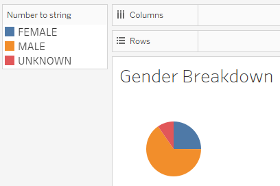
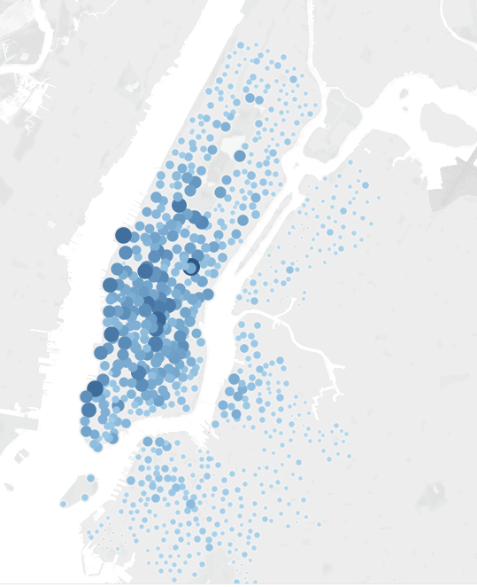
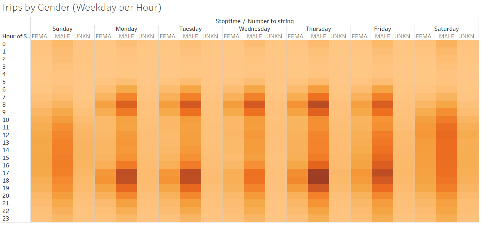

# Citibike Bikesharing Analysis

## Overview

The purpose of this analysis was to analyze the Citibike bikesharing program in New York City on behalf of the city of Des Moines, Iowa, which is considering a similar program. Tableau was used for this project.

[Link to the Tableau Story detailing the analysis](https://public.tableau.com/app/profile/thomas.shane/viz/Module_14_Challenge_Bikesharing_Workbook/Story1)

## Results

Most rides were under 20 minutes, with peak rides lasting only 5 minutes.

The pattern of ride duration is consistent across the genders.

65% of riders are males.

Rides were concentrated in Manhattan, specifically in neighborhoods dominated by office spaces and tourist attractions.

## Summary
The majority of the users of the Citibike bikesharing program were males commuting to and from work. Most of these rides were done by subscribers versus customers using the bikes without a subscription. For further analysis, I would create two visualizations focusing on the differences between customers and subscribers. Specifically, I would create a visualization comparing the trip durations between these two groups. Another visualization I would create would compare the starting locations by user type to see if subscribers were more heavily concentrated in specific areas as well as to see what drove non-subscribers to use the bikes.
